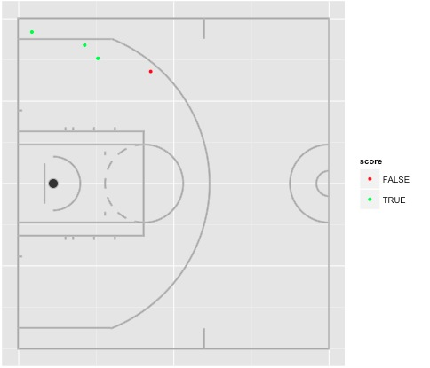
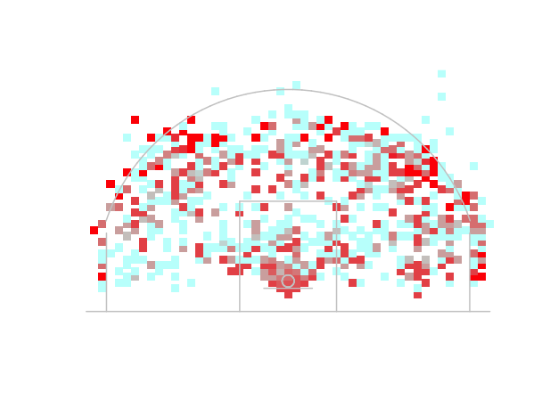
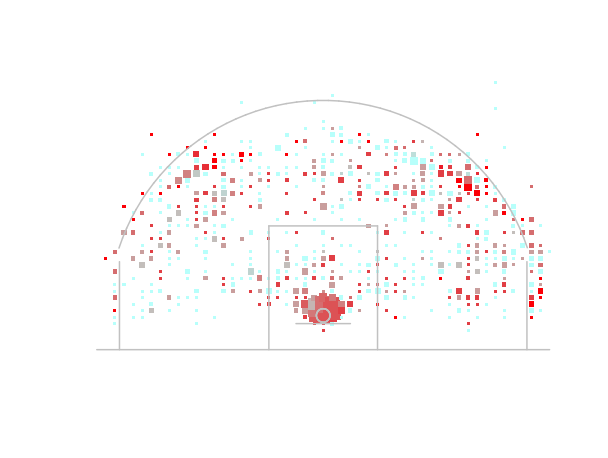
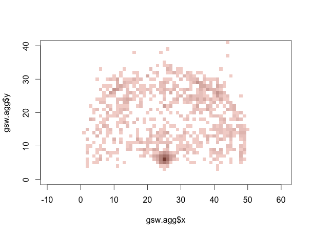

###Sports Analytics
#####This is an analytics project I am working on with the UBC Varisty Basketball Team.

####To-Do
1. Create Court
2. Enter Shot data
3. Create grid
4. Equation for heatmap
5. Apply Heatmap

####Current Progress:

